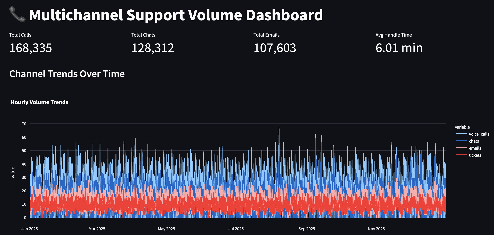

# Multichannel Call Volume Forecasting

A forecasting and workforce planning platform for predicting customer support demand across channels such as calls, chats, emails, and tickets.

## Features
- Synthetic data generation
- Operational dashboard in Streamlit
- Forecasting models (upcoming)
- Staffing recommendations (upcoming)

## Dashboard Preview

## Dashboard Preview

